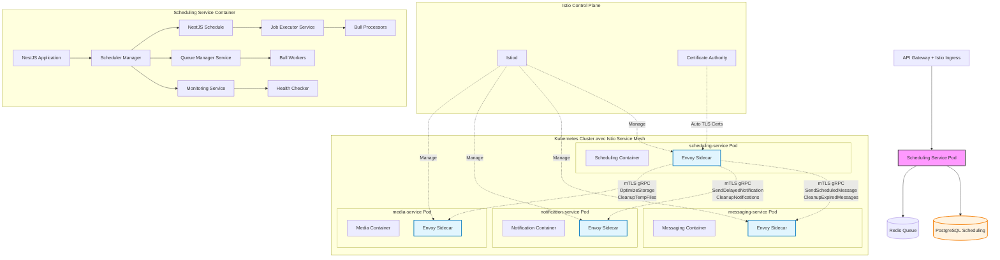
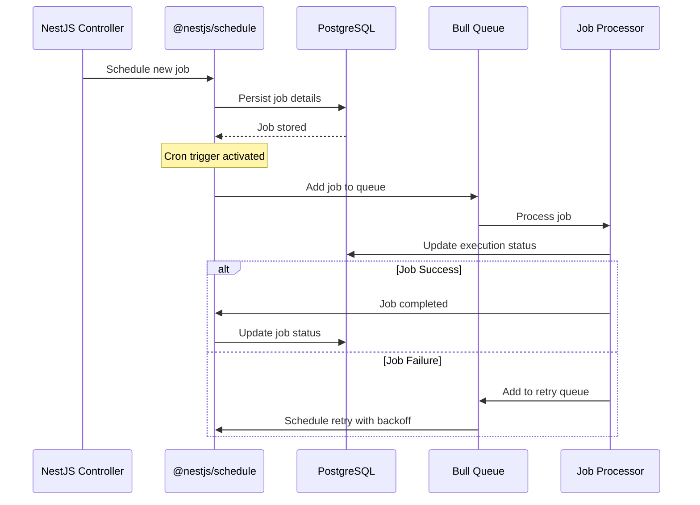
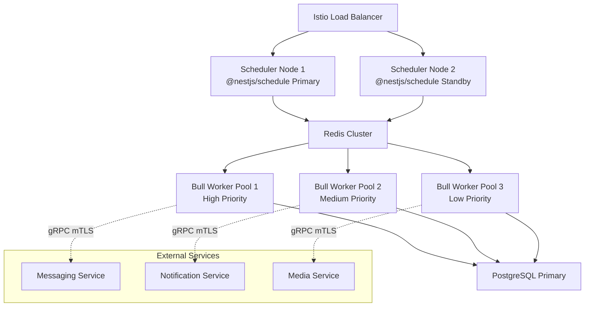

# Scheduling Service (`scheduling-service`) - System Design Document

## 0. Sommaire

- [1. Introduction](#1-introduction)
  - [1.1 Objectif du Document](#11-objectif-du-document)
  - [1.2 Périmètre du Service](#12-périmètre-du-service)
  - [1.3 Relations avec les Autres Services](#13-relations-avec-les-autres-services)
- [2. Architecture Globale](#2-architecture-globale)
  - [2.1 Vue d'Ensemble de l'Architecture avec Istio Service Mesh](#21-vue-densemble-de-larchitecture-avec-istio-service-mesh)
  - [2.2 Principes Architecturaux](#22-principes-architecturaux)
- [3. Choix Technologiques](#3-choix-technologiques)
  - [3.1 Stack Technique](#31-stack-technique)
  - [3.2 Infrastructure](#32-infrastructure)
- [4. Composants Principaux](#4-composants-principaux)
  - [4.1 Structure NestJS/TypeScript](#41-structure-nestjstypescript)
  - [4.2 Moteur de Planification](#42-moteur-de-planification)
  - [4.3 Gestionnaire de Files d'Attente](#43-gestionnaire-de-files-dattente)
  - [4.4 Système de Monitoring](#44-système-de-monitoring)
  - [4.5 Gestionnaire de Tâches](#45-gestionnaire-de-tâches)
  - [4.6 Communication avec les autres services via Istio Service Mesh](#46-communication-avec-les-autres-services-via-istio-service-mesh)
    - [4.6.1 Configuration Istio pour scheduling-service](#461-configuration-istio-pour-scheduling-service)
  - [4.7 Configuration et Modules](#47-configuration-et-modules)
- [5. Types de Tâches Gérées](#5-types-de-tâches-gérées)
  - [5.1 Messages Programmés](#51-messages-programmés)
  - [5.2 Notifications Différées](#52-notifications-différées)
  - [5.3 Tâches de Maintenance](#53-tâches-de-maintenance)
  - [5.4 Nettoyage Automatique](#54-nettoyage-automatique)
  - [5.5 Rapports et Analytics](#55-rapports-et-analytics)
- [6. Planification et Exécution](#6-planification-et-exécution)
  - [6.1 Types de Planification](#61-types-de-planification)
  - [6.2 Persistence et Fiabilité](#62-persistence-et-fiabilité)
  - [6.3 Gestion des Erreurs](#63-gestion-des-erreurs)
- [7. Scaling et Performances](#7-scaling-et-performances)
  - [7.1 Stratégie de Scaling](#71-stratégie-de-scaling)
  - [7.2 Optimisations et Cache](#72-optimisations-et-cache)
  - [7.3 Limites et Quotas avec Istio](#73-limites-et-quotas-avec-istio)
- [8. Monitoring et Observabilité](#8-monitoring-et-observabilité)
  - [8.1 Observabilité Istio](#81-observabilité-istio)
  - [8.2 Logging](#82-logging)
  - [8.3 Métriques](#83-métriques)
  - [8.4 Alerting](#84-alerting)
- [9. Gestion des Erreurs et Résilience](#9-gestion-des-erreurs-et-résilience)
  - [9.1 Stratégie de Gestion des Erreurs](#91-stratégie-de-gestion-des-erreurs)
  - [9.2 Résilience avec Istio](#92-résilience-avec-istio)
  - [9.3 Plan de Reprise d'Activité](#93-plan-de-reprise-dactivité)
- [10. Évolution et Maintenance](#10-évolution-et-maintenance)
  - [10.1 Versionnement](#101-versionnement)
  - [10.2 Mise à Jour et Déploiement](#102-mise-à-jour-et-déploiement)
  - [10.3 Documentation Technique](#103-documentation-technique)
- [11. Considérations Opérationnelles](#11-considérations-opérationnelles)
  - [11.1 DevOps](#111-devops)
  - [11.2 Environnements](#112-environnements)
  - [11.3 Support](#113-support)
- [Appendices](#appendices)
  - [A. Métriques de Performance Cibles](#a-métriques-de-performance-cibles)
  - [B. Estimation des Ressources](#b-estimation-des-ressources)
  - [C. Configuration Istio Examples](#c-configuration-istio-examples)
  - [D. Références](#d-références)

## 1. Introduction

### 1.1 Objectif du Document
Ce document décrit l'architecture et la conception technique du service de planification (`scheduling-service`) de l'application Whispr. Il sert de référence pour l'équipe de développement et les parties prenantes du projet.

### 1.2 Périmètre du Service
Le Scheduling Service est responsable de la gestion et de l'exécution de toutes les tâches programmées de l'écosystème Whispr : messages différés, notifications planifiées, maintenance automatique, nettoyage de données, rapports périodiques et sauvegardes. Il assure la fiabilité et la ponctualité de l'exécution des tâches avec gestion des erreurs et retry automatique.

### 1.3 Relations avec les Autres Services
Le Scheduling Service interagit avec tous les autres microservices de l'écosystème Whispr via Istio Service Mesh :
- **messaging-service** : pour l'envoi de messages programmés
- **notification-service** : pour les notifications différées et rappels
- **media-service** : pour le nettoyage des fichiers temporaires et optimisation
- **user-service** : pour les rapports d'activité et maintenance des profils
- **auth-service** : pour la rotation des tokens et nettoyage des sessions
- **moderation-service** : pour les analyses de contenu différées et mise à jour des modèles

## 2. Architecture Globale

### 2.1 Vue d'Ensemble de l'Architecture avec Istio Service Mesh

Le service de planification fonctionne dans un service mesh Istio qui sécurise automatiquement toutes les communications inter-services :



### 2.2 Principes Architecturaux

- **Fiabilité garantie** : Persistance des tâches avec retry automatique et gestion d'erreurs
- **Zero Trust Network** : Toutes les communications inter-services chiffrées et authentifiées via mTLS
- **Service Mesh Security** : Sécurité implémentée au niveau infrastructure via Istio
- **Scaling horizontal** : Architecture distribuée avec workers multiples
- **Précision temporelle** : Exécution ponctuelle des tâches avec gestion des fuseaux horaires
- **Monitoring complet** : Observabilité de toutes les tâches et métriques de performance
- **Isolation des erreurs** : Échec d'une tâche n'affecte pas les autres
- **Observabilité** : Logging structuré, métriques détaillées et tracing distribué via Istio

## 3. Choix Technologiques

### 3.1 Stack Technique

- **Langage** : TypeScript
- **Runtime** : Node.js
- **Framework** : NestJS
- **Service Mesh** : Istio pour la sécurité et l'observabilité des communications inter-services
- **Proxy Sidecar** : Envoy (injecté automatiquement par Istio)
- **Sécurité Inter-Services** : mTLS automatique via Istio avec rotation de certificats
- **Base de données** : PostgreSQL pour la persistance des tâches
- **Queue System** : Redis + Bull Queue pour l'exécution asynchrone
- **Scheduler** : @nestjs/schedule avec node-cron pour la planification temporelle
- **Communication inter-services** : gRPC over mTLS automatique via Istio Service Mesh
- **ORM** : Prisma pour l'accès aux données avec migrations
- **API** : REST avec décorateurs NestJS et documentation Swagger automatique
- **Validation** : class-validator et class-transformer pour la validation des données
- **Testing** : Jest avec modules de test NestJS pour tests unitaires et d'intégration

### 3.2 Infrastructure

- **Containerisation** : Docker
- **Orchestration** : Kubernetes (GKE)
- **Service Mesh** : Istio avec injection automatique de sidecars Envoy
- **Security** : mTLS automatique, AuthorizationPolicies et NetworkPolicies Istio
- **CI/CD** : GitHub Actions
- **Service Cloud** : Google Cloud Platform (GCP)
- **Monitoring** : Prometheus + Grafana + Kiali (Istio service topology)
- **Logging** : Loki + accès logs Envoy
- **Tracing** : Jaeger (intégré avec Istio pour le tracing distribué)
- **Certificate Management** : Istio CA pour la rotation automatique des certificats mTLS
- **Secrets Management** : Google Secret Manager pour les configurations sensibles

## 4. Composants Principaux

### 4.1 Structure NestJS/TypeScript

L'architecture NestJS du service est organisée comme suit :

```
src/
├── app.module.ts                    # Module racine de l'application
├── main.ts                         # Point d'entrée Bootstrap NestJS
├── config/                         # Configuration
│   ├── database.config.ts          # Configuration PostgreSQL
│   ├── redis.config.ts             # Configuration Redis/Bull
│   ├── scheduler.config.ts         # Configuration @nestjs/schedule
│   └── app.config.ts               # Configuration globale
├── modules/                        # Modules NestJS
│   ├── scheduler/                  # Module de planification
│   │   ├── scheduler.module.ts     # Module principal
│   │   ├── controllers/
│   │   │   ├── jobs.controller.ts        # Gestion des tâches
│   │   │   ├── schedules.controller.ts   # Planification
│   │   │   └── monitoring.controller.ts  # Monitoring
│   │   ├── services/
│   │   │   ├── scheduler.service.ts      # Service principal
│   │   │   ├── job-executor.service.ts   # Exécuteur de tâches
│   │   │   ├── persistence.service.ts    # Persistance des tâches
│   │   │   └── timezone.service.ts       # Gestion des fuseaux horaires
│   │   ├── entities/
│   │   │   ├── job.entity.ts             # Entité Job (Prisma)
│   │   │   ├── schedule.entity.ts        # Entité Schedule
│   │   │   └── execution.entity.ts       # Entité Execution
│   │   └── dto/
│   │       ├── create-job.dto.ts         # DTO création job
│   │       ├── schedule-job.dto.ts       # DTO planification
│   │       └── job-response.dto.ts       # DTO réponses
│   ├── tasks/                      # Module des tâches
│   │   ├── tasks.module.ts         # Module tâches
│   │   ├── processors/             # Processeurs Bull Queue
│   │   │   ├── messaging.processor.ts    # Processeur messaging
│   │   │   ├── notification.processor.ts # Processeur notifications
│   │   │   ├── maintenance.processor.ts  # Processeur maintenance
│   │   │   └── cleanup.processor.ts      # Processeur nettoyage
│   │   └── services/
│   │       ├── messaging-tasks.service.ts    # Tâches messaging
│   │       ├── notification-tasks.service.ts # Tâches notifications
│   │       ├── maintenance-tasks.service.ts  # Tâches maintenance
│   │       └── cleanup-tasks.service.ts      # Tâches nettoyage
│   ├── queues/                     # Module des queues
│   │   ├── queues.module.ts        # Module queues
│   │   ├── services/
│   │   │   ├── queue-manager.service.ts  # Gestionnaire de queues
│   │   │   └── priority-queue.service.ts # Gestion des priorités
│   │   └── interfaces/
│   │       ├── job.interface.ts          # Interface Job
│   │       └── queue.interface.ts        # Interface Queue
│   ├── monitoring/                 # Module monitoring
│   │   ├── monitoring.module.ts    # Module monitoring
│   │   ├── services/
│   │   │   ├── metrics.service.ts        # Métriques Prometheus
│   │   │   ├── health.service.ts         # Health checks
│   │   │   └── alerting.service.ts       # Système d'alertes
│   │   └── controllers/
│   │       └── health.controller.ts      # Controller health
│   ├── grpc/                       # Module gRPC
│   │   ├── grpc.module.ts          # Module gRPC
│   │   └── clients/
│   │       ├── messaging.client.ts       # Client messaging-service
│   │       ├── notification.client.ts    # Client notification-service
│   │       ├── media.client.ts           # Client media-service
│   │       └── user.client.ts            # Client user-service
│   └── common/                     # Module commun
│       ├── common.module.ts        # Module utilitaires communs
│       ├── filters/
│       │   ├── http-exception.filter.ts  # Filtre d'exceptions
│       │   └── job-exception.filter.ts   # Filtre exceptions jobs
│       ├── interceptors/
│       │   ├── logging.interceptor.ts    # Intercepteur de logs
│       │   ├── timing.interceptor.ts     # Mesure de performance
│       │   └── correlation.interceptor.ts # Correlation IDs
│       ├── pipes/
│       │   ├── validation.pipe.ts        # Pipe de validation
│       │   └── timezone.pipe.ts          # Validation timezone
│       ├── decorators/
│       │   ├── scheduled-task.decorator.ts # Décorateur tâches programmées
│       │   └── queue-job.decorator.ts     # Décorateur jobs queue
│       └── utils/
│           ├── timezone.util.ts          # Utilitaires timezone
│           ├── retry.util.ts             # Logique de retry
│           └── cron.util.ts              # Utilitaires cron
```

### 4.2 Moteur de Planification

Le cœur du système utilise @nestjs/schedule avec persistance PostgreSQL :



### 4.3 Gestionnaire de Files d'Attente

Le système de queues Bull Queue gère l'exécution asynchrone :

- **High Priority Queue** : Messages programmés, notifications critiques
- **Medium Priority Queue** : Rapports, analytics
- **Low Priority Queue** : Nettoyage, maintenance
- **Failed Jobs Queue** : Tâches échouées pour investigation
- **Delayed Queue** : Tâches avec retry et backoff exponentiel

### 4.4 Système de Monitoring

Monitoring complet des tâches et de la santé du système :

- **Job Monitoring** : Statut, durée, succès/échec de chaque tâche
- **Queue Monitoring** : Longueur des queues, temps de traitement
- **System Monitoring** : CPU, mémoire, connections base de données
- **Service Monitoring** : Santé des services externes via health checks
- **SLA Monitoring** : Respect des délais d'exécution

### 4.5 Gestionnaire de Tâches

Types de tâches supportées avec leurs caractéristiques :

| Type | Priorité | Retry | Timeout | Persistence |
|------|----------|--------|---------|-------------|
| Messages programmés | High | 3x | 30s | Jusqu'à envoi |
| Notifications différées | High | 5x | 15s | Jusqu'à envoi |
| Nettoyage médias | Low | 2x | 300s | 7 jours |
| Rapports analytics | Medium | 1x | 120s | 30 jours |
| Maintenance DB | Medium | 3x | 600s | Permanent |

### 4.6 Communication avec les autres services via Istio Service Mesh

**Interfaces gRPC consommées** :
- **messaging-service** :
  - `SendScheduledMessage`: envoi de messages programmés
  - `CleanupExpiredMessages`: nettoyage des messages expirés
- **notification-service** :
  - `SendDelayedNotification`: envoi de notifications différées
  - `CleanupNotificationHistory`: nettoyage de l'historique
- **media-service** :
  - `OptimizeStorage`: optimisation du stockage
  - `CleanupTempFiles`: nettoyage des fichiers temporaires
- **user-service** :
  - `GenerateActivityReport`: génération de rapports d'activité
  - `CleanupInactiveUsers`: nettoyage des comptes inactifs

**Interfaces REST exposées** :
- **Jobs** : POST /api/v1/jobs (@Post() avec @Body(CreateJobDto)), GET /api/v1/jobs (@Get() avec @Query()), DELETE /api/v1/jobs/{id} (@Delete() avec @Param())
- **Schedules** : POST /api/v1/schedules (@Post() avec @Body(ScheduleJobDto)), PUT /api/v1/schedules/{id} (@Put() avec @Param() et @Body())
- **Monitoring** : GET /api/v1/monitoring/status (@Get() avec @UseGuards()), GET /api/v1/monitoring/metrics (@Get() avec métriques Prometheus)
- **Health** : GET /api/v1/health (@Get() avec @HealthCheck() et Terminus)

#### 4.6.1 Configuration Istio pour scheduling-service

```yaml
# AuthorizationPolicy pour scheduling-service vers messaging-service
apiVersion: security.istio.io/v1beta1
kind: AuthorizationPolicy
metadata:
  name: scheduling-to-messaging
  namespace: whispr
spec:
  selector:
    matchLabels:
      app: messaging-service
  rules:
  - from:
    - source:
        principals: ["cluster.local/ns/whispr/sa/scheduling-service"]
  - to:
    - operation:
        methods: ["POST"]
        paths: ["/messaging.MessagingService/SendScheduledMessage"]

---
# AuthorizationPolicy pour clients vers scheduling-service
apiVersion: security.istio.io/v1beta1
kind: AuthorizationPolicy
metadata:
  name: clients-to-scheduling
  namespace: whispr
spec:
  selector:
    matchLabels:
      app: scheduling-service
  rules:
  - from:
    - source:
        principals: ["cluster.local/ns/whispr/sa/api-gateway"]
  - to:
    - operation:
        methods: ["GET", "POST", "PUT", "DELETE"]
        paths: ["/api/v1/*"]
```

### 4.7 Modules et Injection de Dépendances

- **SchedulerModule** : module principal avec @nestjs/schedule et Bull Queue
- **TasksModule** : module pour les définitions de tâches et processeurs
- **QueuesModule** : module pour la gestion des files d'attente Bull
- **GrpcModule** : module pour les clients gRPC vers autres microservices via Istio mTLS
- **MonitoringModule** : module de monitoring avec métriques et health checks
- **ConfigModule** : gestion centralisée de la configuration avec validation
- **DatabaseModule** : intégration PostgreSQL avec Prisma ORM

## 5. Types de Tâches Gérées

### 5.1 Messages Programmés

Gestion des messages à envoyer à une heure précise :

```typescript
import { Process, Processor } from '@nestjs/bull';
import { Job } from 'bull';
import { Injectable, Logger } from '@nestjs/common';
import { MessagingClientService } from '../grpc/messaging.client';

@Processor('high-priority')
@Injectable()
export class MessageProcessor {
  private readonly logger = new Logger(MessageProcessor.name);
  
  constructor(
    private readonly messagingClient: MessagingClientService
  ) {}
  
  @Process('send-scheduled-message')
  async sendScheduledMessage(job: Job<ScheduledMessageData>) {
    const { messageData } = job.data;
    
    try {
      // Validation du message
      if (!this.validateMessageData(messageData)) {
        throw new Error('Invalid message data');
      }
      
      // Envoi via messaging-service
      const result = await this.messagingClient.sendMessage(messageData);
      
      // Log du succès
      this.logger.log(`Scheduled message sent: ${messageData.id}`);
      return result;
      
    } catch (error) {
      this.logger.error(`Failed to send scheduled message: ${error.message}`);
      
      // Retry automatique avec backoff exponentiel (Bull Queue)
      const backoffDelay = Math.pow(2, job.attemptsMade) * 60000; // 1min, 2min, 4min...
      throw new Error(`Retry in ${backoffDelay}ms: ${error.message}`);
    }
  }
  
  private validateMessageData(messageData: any): boolean {
    return messageData && messageData.id && messageData.content;
  }
}
```

### 5.2 Notifications Différées

Notifications programmées avec gestion des fuseaux horaires :

- **Rappels** : Notifications de rappel pour événements
- **Suivis** : Notifications de suivi d'activité
- **Alertes** : Alertes de sécurité ou quota
- **Résumés** : Résumés quotidiens/hebdomadaires
- **Anniversaires** : Notifications d'anniversaires ou événements

### 5.3 Tâches de Maintenance

Maintenance automatique du système :

- **Vacuum PostgreSQL** : Optimisation des bases de données (quotidien)
- **Index rebuild** : Reconstruction d'index (hebdomadaire)
- **Statistics update** : Mise à jour des statistiques (quotidien)
- **Log rotation** : Rotation des logs système (quotidien)
- **Certificate renewal** : Renouvellement des certificats (selon expiration)

### 5.4 Nettoyage Automatique

Nettoyage automatique des données expirées :

- **Messages temporaires** : Suppression des messages avec TTL
- **Fichiers temporaires** : Nettoyage des uploads échoués
- **Sessions expirées** : Nettoyage des sessions auth
- **Cache invalidation** : Invalidation des caches expirés
- **Audit logs** : Archivage des logs d'audit anciens

### 5.5 Rapports et Analytics

Génération automatique de rapports :

- **Rapports d'usage** : Statistiques d'utilisation quotidiennes
- **Rapports de sécurité** : Incidents et anomalies hebdomadaires
- **Rapports de performance** : Métriques système mensuelles
- **Rapports de modération** : Statistiques de contenu modéré
- **Rapports financiers** : Utilisation des ressources pour billing

## 6. Planification et Exécution

### 6.1 Types de Planification

```typescript
// Types de planification supportés avec @nestjs/schedule
import { Injectable } from '@nestjs/common';
import { Cron, CronExpression, Interval, Timeout } from '@nestjs/schedule';

@Injectable()
export class TaskSchedulerService {
  
  // Exécution quotidienne à 2h du matin
  @Cron('0 2 * * *', {
    name: 'daily_cleanup',
    timeZone: 'UTC'
  })
  handleDailyCleanup() {
    // Logique de nettoyage quotidien
  }
  
  // Exécution hebdomadaire le lundi à 9h
  @Cron('0 9 * * 1', {
    name: 'weekly_reports',
    timeZone: 'Europe/Paris'
  })
  handleWeeklyReports() {
    // Génération de rapports hebdomadaires
  }
  
  // Exécution toutes les 30 minutes
  @Interval('notification_check', 30 * 60 * 1000)
  handleNotificationCheck() {
    // Vérification des notifications en attente
  }
  
  // Exécution unique après délai
  @Timeout('startup_tasks', 5000)
  handleStartupTasks() {
    // Tâches d'initialisation
  }
}
```

### 6.2 Persistence et Fiabilité

- **WAL PostgreSQL** : Write-Ahead Logging pour durabilité
- **Transaction isolation** : Prévention des exécutions multiples
- **Idempotence** : Tâches idempotentes pour sécurité
- **State management** : Suivi d'état précis des tâches
- **Recovery** : Récupération automatique après redémarrage

### 6.3 Gestion des Erreurs

- **Retry exponential backoff** : Délais croissants entre tentatives
- **Circuit breaker** : Protection contre services défaillants
- **Dead letter queue** : Stockage des tâches définitivement échouées
- **Error categorization** : Classification des erreurs (transient vs permanent)
- **Alerting** : Notifications automatiques sur erreurs critiques

## 7. Scaling et Performances

### 7.1 Stratégie de Scaling

- **Horizontal scaling** : Ajout de workers Celery selon la charge
- **Auto-scaling** : HPA Kubernetes basé sur longueur des queues
- **Load balancing** : Distribution via Istio avec session affinity
- **Resource isolation** : Pools de workers par type de tâche
- **Performance monitoring** : Métriques en temps réel



### 7.2 Optimisations et Cache

- **Job metadata cache** : Cache Redis des métadonnées fréquentes
- **Schedule optimization** : Regroupement de tâches similaires
- **Connection pooling** : Pools de connexions PostgreSQL et Redis
- **Lazy loading** : Chargement paresseux des configurations
- **Compression** : Compression des payloads de tâches volumineuses

### 7.3 Limites et Quotas avec Istio

| Métrique | Limite | Contrôle |
|----------|--------|----------|
| Jobs par utilisateur/jour | 1000 | Rate limiting Istio |
| Taille payload tâche | 1 MB | Validation FastAPI |
| Concurrent jobs par utilisateur | 10 | Application level |
| Retry maximum par tâche | 5 | Worker configuration |
| Timeout maximum | 30 minutes | Task timeout |
| Queue size maximum | 10000 items | Redis configuration |

## 8. Monitoring et Observabilité

### 8.1 Observabilité Istio

- **Kiali** : Visualisation des appels vers services externes
- **Jaeger** : Tracing distribué pour les tâches complexes
- **Prometheus** : Métriques automatiques Istio + métriques custom
- **Grafana** : Dashboards pour performance et exécution des tâches
- **Envoy Access Logs** : Logs détaillés des communications

### 8.2 Logging

- **NestJS Logger** : Logger intégré avec niveaux configurables et contexte
- **Logging Interceptor** : Interception automatique des requêtes/réponses
- **Structured Logging** : JSON avec correlation IDs et contexte de tâches
- **Task Lifecycle** : Logs complets du cycle de vie avec décorateurs @Log()
- **Error Context** : Exception filters enrichis avec contexte détaillé
- **Performance Logs** : Durée d'exécution avec interceptors de timing
- **Audit Logs** : Traçabilité des opérations via guards d'audit

### 8.3 Métriques

- **Métriques Istio automatiques** :
  - Latence des appels vers services externes
  - Taux de succès/erreur des communications gRPC
  - Throughput des exécutions de tâches

- **Métriques métier personnalisées** :
  - Nombre de tâches exécutées par type
  - Temps moyen d'exécution par catégorie
  - Taux de succès des tâches
  - Longueur des queues par priorité
  - SLA des exécutions (ponctualité)

### 8.4 Alerting

- **Alertes Istio** :
  - Dégradation connectivité vers services externes
  - Échecs de certificats mTLS
  - Latence élevée dans les communications

- **Alertes business** :
  - Queue overflow (> 1000 tâches en attente)
  - Taux d'échec élevé (> 10% sur 1h)
  - Délai d'exécution critique (> 15min de retard)
  - Service externe indisponible
  - Base de données PostgreSQL à 80% de capacité

## 9. Gestion des Erreurs et Résilience

### 9.1 Stratégie de Gestion des Erreurs

- **Exception Filters NestJS** : Gestion centralisée des erreurs avec filtres personnalisés
- **Bull Queue Retry** : Retry automatique avec backoff exponentiel intégré
- **Circuit Breaker Pattern** : Protection via @nestjs/circuit-breaker pour services externes
- **Error Classification** : Distinction erreurs temporaires vs permanentes via custom exceptions
- **Graceful Degradation** : Mode dégradé avec guards et interceptors spécialisés
- **Dead Letter Queue** : Gestion des échecs définitifs avec Bull Queue
- **Human Escalation** : Notifications automatiques via notification-service

### 9.2 Résilience avec Istio

- **Circuit Breakers** : Protection contre services externes défaillants
- **Timeout Management** : Timeouts appropriés par type de tâche
- **Retry Policies** : Retries automatiques avec jitter
- **Bulkhead Pattern** : Isolation des ressources par type de tâche
- **Health Checks** : Vérification continue de la santé du service

### 9.3 Plan de Reprise d'Activité

- **RPO** : 5 minutes maximum (tâches en cours)
- **RTO** : 2 minutes maximum
- **State recovery** : Récupération automatique de l'état des tâches
- **Queue persistence** : Sauvegarde des queues Redis
- **Scheduler failover** : Basculement automatique APScheduler

## 10. Évolution et Maintenance

### 10.1 Versionnement

- **API Versioning** : Versionnement sémantique des endpoints
- **Schema Evolution** : Migration des structures de données de tâches
- **Backward Compatibility** : Support des anciennes versions de tâches
- **Feature Flags** : Déploiement progressif des nouvelles fonctionnalités

### 10.2 Mise à Jour et Déploiement

- **Blue/Green Deployment** : Déploiement sans interruption via Istio
- **Rolling Updates** : Mise à jour graduelle des workers
- **Job Migration** : Migration des tâches en cours lors des déploiements
- **Health Checks** : Validation automatique post-déploiement
- **Rollback** : Retour arrière automatique en cas d'échec

### 10.3 Documentation Technique

- **API Documentation** : Swagger automatiquement générée via décorateurs @ApiOperation, @ApiResponse
- **NestJS Documentation** : Documentation des modules, services et controllers
- **Task Documentation** : Documentation détaillée de chaque type de tâche avec exemples
- **Integration Guides** : Guide d'intégration pour nouveaux services
- **Troubleshooting** : Guide de résolution des problèmes courants
- **Runbooks** : Procédures opérationnelles pour équipes support

## 11. Considérations Opérationnelles

### 11.1 DevOps

- **CI/CD Pipeline** : GitHub Actions avec build NestJS et tests automatisés
- **NestJS Build** : Compilation TypeScript avec optimisations de production
- **Testing Strategy** : Jest avec TestingModule NestJS pour tests unitaires, intégration et end-to-end
- **Performance Testing** : Tests de charge sur les queues Bull et workers
- **Chaos Engineering** : Tests de résilience avec injection d'erreurs et pannes simulées

### 11.2 Environnements

- **Development** : Environnement local avec Redis standalone
- **Staging** : Environnement de test avec données réelles anonymisées
- **Production** : Environnement de production avec haute disponibilité
- **Isolation** : Séparation stricte des tâches entre environnements

### 11.3 Support

- **Task Debugging** : Outils pour analyser les échecs de tâches
- **Performance Analysis** : Analyse des goulots d'étranglement
- **Capacity Planning** : Prévision des besoins en ressources
- **SLA Monitoring** : Surveillance du respect des SLA

---

## Appendices

### A. Métriques de Performance Cibles

| Métrique | Cible | Monitoring |
|----------|-------|------------|
| Précision d'exécution | < 30 secondes d'écart | Prometheus + Grafana |
| Taux de succès des tâches | > 99% | Custom metrics |
| Temps de traitement queue | < 5 secondes | Redis metrics |
| 99e percentile latence | < 60 secondes | Istio + Jaeger |
| Disponibilité du service | > 99.9% | Istio Health Checks |
| Récupération après crash | < 2 minutes | Custom monitoring |
| Débit de traitement | > 1000 tâches/minute | Bull Queue metrics |

### B. Estimation des Ressources

| Ressource | Estimation Initiale | Istio Overhead |
|-----------|---------------------|----------------|
| Scheduler nodes | 2 instances | + Envoy sidecars |
| CPU par node | 2 vCPU | + 0.1 vCPU (Envoy) |
| Mémoire par node | 4 GB RAM | + 200MB (Envoy) |
| Worker nodes | 5 instances | + Envoy sidecars |
| CPU worker | 1 vCPU | + 0.1 vCPU (Envoy) |
| Mémoire worker | 2 GB RAM | + 200MB (Envoy) |
| Stockage PostgreSQL | 50 GB initial | - |
| Redis memory | 8 GB | - |
| Tâches par jour | 100,000 | - |

### C. Configuration Istio Examples

```yaml
# DestinationRule pour scheduling-service avec circuit breaker
apiVersion: networking.istio.io/v1beta1
kind: DestinationRule
metadata:
  name: scheduling-circuit-breaker
  namespace: whispr
spec:
  host: scheduling-service
  trafficPolicy:
    outlierDetection:
      consecutiveErrors: 3
      interval: 30s
      baseEjectionTime: 30s
    circuitBreaker:
      maxConnections: 50
      maxRequestsPerConnection: 10
      maxRetries: 3
    connectionPool:
      http:
        http1MaxPendingRequests: 100
        maxRequestsPerConnection: 10
```

### D. Références

- [NestJS Schedule Documentation](https://docs.nestjs.com/techniques/task-scheduling)
- [Bull Queue Documentation](https://github.com/OptimalBits/bull)
- [NestJS Bull Integration](https://docs.nestjs.com/techniques/queues)
- [NestJS Documentation](https://docs.nestjs.com/)
- [Prisma Documentation](https://www.prisma.io/docs/)
- [class-validator Documentation](https://github.com/typestack/class-validator)
- [Istio Security Best Practices](https://istio.io/latest/docs/ops/best-practices/security/)
- [Node.js Cron Best Practices](https://www.npmjs.com/package/node-cron)