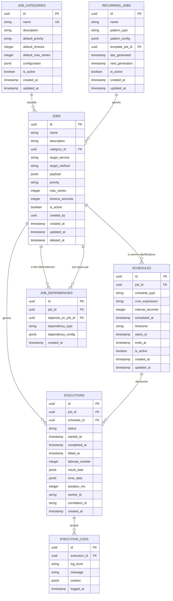
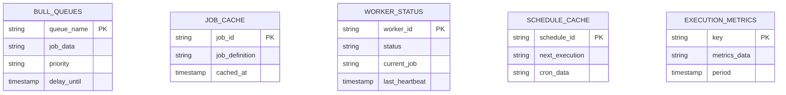
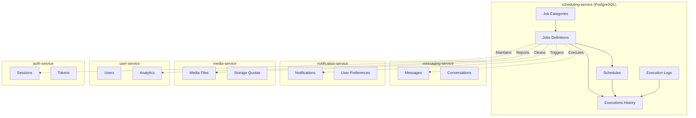
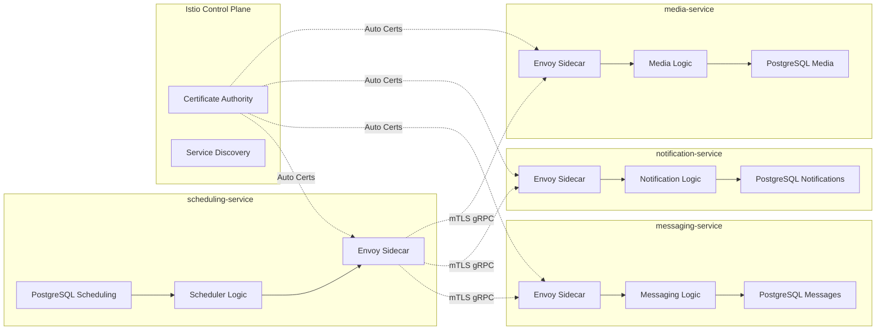

# Scheduling Service (`scheduling-service`) - Conception de la Base de Données

## 0. Sommaire

- [1. Introduction et Principes de Conception](#1-introduction-et-principes-de-conception)
  - [1.1 Objectif](#11-objectif)
  - [1.2 Principes Architecturaux](#12-principes-architecturaux)
  - [1.3 Technologie](#13-technologie)
- [2. Schéma PostgreSQL du Service de Scheduling](#2-schéma-postgresql-du-service-de-scheduling)
  - [2.1 Vue d'Ensemble](#21-vue-densemble)
  - [2.2 Description des Tables](#22-description-des-tables)
- [3. Données Temporaires dans Redis](#3-données-temporaires-dans-redis)
  - [3.1 Vue d'Ensemble](#31-vue-densemble)
  - [3.2 Description des Structures Redis](#32-description-des-structures-redis)
- [4. Relations avec les Autres Services](#4-relations-avec-les-autres-services)
  - [4.1 Démarcation des Responsabilités](#41-démarcation-des-responsabilités)
  - [4.2 Synchronisation des Données](#42-synchronisation-des-données)
- [5. Considérations de Sécurité](#5-considérations-de-sécurité)
  - [5.1 Protection des Tâches Sensibles](#51-protection-des-tâches-sensibles)
  - [5.2 Audit et Traçabilité](#52-audit-et-traçabilité)
  - [5.3 Isolation des Données](#53-isolation-des-données)
- [6. Considérations de Performance](#6-considérations-de-performance)
  - [6.1 Indexation](#61-indexation)
  - [6.2 Partitionnement](#62-partitionnement)
  - [6.3 Optimisations Redis](#63-optimisations-redis)
- [7. Migrations et Évolution du Schéma](#7-migrations-et-évolution-du-schéma)
  - [7.1 Stratégie de Migration](#71-stratégie-de-migration)
- [8. Scripts SQL d'Initialisation](#8-scripts-sql-dinitialisation)
  - [8.1 Création du Schéma PostgreSQL](#81-création-du-schéma-postgresql)
- [9. Communication Inter-Services avec Istio](#9-communication-inter-services-avec-istio)
  - [9.1 Architecture Service Mesh pour les Données](#91-architecture-service-mesh-pour-les-données)
  - [9.2 Événements et Synchronisation avec mTLS](#92-événements-et-synchronisation-avec-mtls)
  - [9.3 Gestion des Références Externes avec Istio](#93-gestion-des-références-externes-avec-istio)
  - [9.4 Monitoring des Données Inter-Services](#94-monitoring-des-données-inter-services)
  - [9.5 Résilience des Données](#95-résilience-des-données)

## 1. Introduction et Principes de Conception

### 1.1 Objectif
Ce document décrit la structure de la base de données du service de planification (scheduling-service) de l'application Whispr, en détaillant les modèles de données, les relations, et les considérations de performance pour la gestion des tâches programmées, l'exécution asynchrone, et la coordination des activités système.

### 1.2 Principes Architecturaux
- **Fiabilité garantie** : Persistance de toutes les tâches avec tracking d'exécution complet
- **Exécution distribuée** : Support du scaling horizontal avec coordination via Redis
- **Audit complet** : Traçabilité de toutes les exécutions avec logs détaillés
- **Performance optimisée** : Indexation et cache pour accès rapide aux tâches actives
- **Gestion des erreurs** : Retry automatique avec escalade et dead letter queue
- **Isolation temporelle** : Gestion précise des fuseaux horaires et planifications
- **Intégrité référentielle** : Liens cohérents avec les services cibles

### 1.3 Technologie
- **PostgreSQL** : Pour la persistance des tâches, planifications et historique
- **Prisma** : ORM pour NestJS utilisé pour l'accès aux données
- **Redis** : Pour Bull Queue, cache des tâches et coordination des workers
- **Bull Queue** : Système de files d'attente pour l'exécution asynchrone

## 2. Schéma PostgreSQL du Service de Scheduling

### 2.1 Vue d'Ensemble



### 2.2 Description des Tables

#### 2.2.1 JOBS
Stocke la définition des tâches à exécuter.

| Colonne | Type | Description | Contraintes |
|---------|------|-------------|-------------|
| id | UUID | Identifiant unique de la tâche | PK, NOT NULL |
| name | VARCHAR(200) | Nom de la tâche | NOT NULL |
| description | TEXT | Description détaillée | NULL |
| category_id | UUID | Référence à la catégorie | FK, NOT NULL |
| target_service | VARCHAR(100) | Service cible à appeler | NOT NULL |
| target_method | VARCHAR(100) | Méthode à exécuter | NOT NULL |
| payload | JSONB | Données à passer à la tâche | NOT NULL, DEFAULT '{}' |
| priority | VARCHAR(20) | Priorité d'exécution | NOT NULL, DEFAULT 'medium' |
| max_retries | INTEGER | Nombre maximum de tentatives | NOT NULL, DEFAULT 3 |
| timeout_seconds | INTEGER | Timeout en secondes | NOT NULL, DEFAULT 300 |
| is_active | BOOLEAN | Tâche active | NOT NULL, DEFAULT TRUE |
| created_by | UUID | Utilisateur créateur (peut être NULL pour système) | NULL |
| created_at | TIMESTAMP | Date/heure de création | NOT NULL |
| updated_at | TIMESTAMP | Date/heure de mise à jour | NOT NULL |
| deleted_at | TIMESTAMP | Date/heure de suppression (soft delete) | NULL |

**Indices** :
- PRIMARY KEY sur `id`
- INDEX sur `category_id` pour filtrage par catégorie
- INDEX sur `target_service` pour requêtes par service
- INDEX sur `is_active` pour filtrage des tâches actives
- INDEX sur `created_by` pour tâches par utilisateur
- INDEX GIN sur `payload` pour recherche dans les données

#### 2.2.2 SCHEDULES
Stocke les planifications des tâches (quand les exécuter).

| Colonne | Type | Description | Contraintes |
|---------|------|-------------|-------------|
| id | UUID | Identifiant unique de la planification | PK, NOT NULL |
| job_id | UUID | Référence à la tâche | FK, NOT NULL |
| schedule_type | VARCHAR(20) | Type de planification | NOT NULL |
| cron_expression | VARCHAR(100) | Expression cron si applicable | NULL |
| interval_seconds | INTEGER | Intervalle en secondes si applicable | NULL |
| scheduled_at | TIMESTAMP | Date/heure précise si applicable | NULL |
| timezone | VARCHAR(50) | Fuseau horaire | NOT NULL, DEFAULT 'UTC' |
| starts_at | TIMESTAMP | Date de début de validité | NULL |
| ends_at | TIMESTAMP | Date de fin de validité | NULL |
| is_active | BOOLEAN | Planification active | NOT NULL, DEFAULT TRUE |
| created_at | TIMESTAMP | Date/heure de création | NOT NULL |
| updated_at | TIMESTAMP | Date/heure de mise à jour | NOT NULL |

**Contraintes** :
- CHECK (schedule_type IN ('cron', 'interval', 'once', 'immediate'))
- CHECK (priority IN ('low', 'medium', 'high', 'critical'))

**Indices** :
- PRIMARY KEY sur `id`
- INDEX sur `job_id` pour récupération par tâche
- INDEX sur `schedule_type` pour filtrage par type
- INDEX sur `scheduled_at` pour planifications ponctuelles
- INDEX sur `is_active` pour planifications actives

#### 2.2.3 EXECUTIONS
Historique des exécutions de tâches.

| Colonne | Type | Description | Contraintes |
|---------|------|-------------|-------------|
| id | UUID | Identifiant unique de l'exécution | PK, NOT NULL |
| job_id | UUID | Référence à la tâche | FK, NOT NULL |
| schedule_id | UUID | Référence à la planification | FK, NULL |
| status | VARCHAR(20) | Statut de l'exécution | NOT NULL |
| started_at | TIMESTAMP | Date/heure de début | NOT NULL |
| completed_at | TIMESTAMP | Date/heure de fin si succès | NULL |
| failed_at | TIMESTAMP | Date/heure d'échec si erreur | NULL |
| attempt_number | INTEGER | Numéro de tentative | NOT NULL, DEFAULT 1 |
| result_data | JSONB | Données de résultat si succès | NULL |
| error_data | JSONB | Données d'erreur si échec | NULL |
| duration_ms | INTEGER | Durée d'exécution en millisecondes | NULL |
| worker_id | VARCHAR(100) | Identifiant du worker | NULL |
| correlation_id | VARCHAR(100) | ID de corrélation pour tracing | NULL |
| created_at | TIMESTAMP | Date/heure de création | NOT NULL |

**Contraintes** :
- CHECK (status IN ('pending', 'running', 'completed', 'failed', 'cancelled', 'timeout'))
- CHECK (attempt_number > 0)

**Indices** :
- PRIMARY KEY sur `id`
- INDEX sur `job_id` pour historique par tâche
- INDEX sur `status` pour filtrage par statut
- INDEX sur `started_at` pour requêtes temporelles
- INDEX sur `correlation_id` pour tracing
- INDEX composite sur `(job_id, started_at)` pour performance

#### 2.2.4 JOB_CATEGORIES
Catégories de tâches avec configuration par défaut.

| Colonne | Type | Description | Contraintes |
|---------|------|-------------|-------------|
| id | UUID | Identifiant unique de la catégorie | PK, NOT NULL |
| name | VARCHAR(100) | Nom de la catégorie | UNIQUE, NOT NULL |
| description | TEXT | Description de la catégorie | NULL |
| default_priority | VARCHAR(20) | Priorité par défaut | NOT NULL, DEFAULT 'medium' |
| default_timeout | INTEGER | Timeout par défaut en secondes | NOT NULL, DEFAULT 300 |
| default_max_retries | INTEGER | Retries par défaut | NOT NULL, DEFAULT 3 |
| configuration | JSONB | Configuration spécifique | NOT NULL, DEFAULT '{}' |
| is_active | BOOLEAN | Catégorie active | NOT NULL, DEFAULT TRUE |
| created_at | TIMESTAMP | Date/heure de création | NOT NULL |
| updated_at | TIMESTAMP | Date/heure de mise à jour | NOT NULL |

**Indices** :
- PRIMARY KEY sur `id`
- UNIQUE sur `name`
- INDEX sur `is_active` pour catégories actives

#### 2.2.5 EXECUTION_LOGS
Logs détaillés des exécutions de tâches.

| Colonne | Type | Description | Contraintes |
|---------|------|-------------|-------------|
| id | UUID | Identifiant unique du log | PK, NOT NULL |
| execution_id | UUID | Référence à l'exécution | FK, NOT NULL |
| log_level | VARCHAR(10) | Niveau de log | NOT NULL |
| message | TEXT | Message de log | NOT NULL |
| context | JSONB | Contexte additionnel | NOT NULL, DEFAULT '{}' |
| logged_at | TIMESTAMP | Date/heure du log | NOT NULL |

**Contraintes** :
- CHECK (log_level IN ('DEBUG', 'INFO', 'WARN', 'ERROR', 'FATAL'))

**Indices** :
- PRIMARY KEY sur `id`
- INDEX sur `execution_id` pour logs par exécution
- INDEX sur `log_level` pour filtrage par niveau
- INDEX sur `logged_at` pour requêtes temporelles

#### 2.2.6 RECURRING_JOBS
Gestion des tâches récurrentes avec génération automatique.

| Colonne | Type | Description | Contraintes |
|---------|------|-------------|-------------|
| id | UUID | Identifiant unique | PK, NOT NULL |
| name | VARCHAR(200) | Nom du pattern | NOT NULL |
| pattern_type | VARCHAR(50) | Type de pattern | NOT NULL |
| pattern_config | JSONB | Configuration du pattern | NOT NULL |
| template_job_id | UUID | Référence au job template | FK, NOT NULL |
| last_generated | TIMESTAMP | Dernière génération | NULL |
| next_generation | TIMESTAMP | Prochaine génération | NULL |
| is_active | BOOLEAN | Pattern actif | NOT NULL, DEFAULT TRUE |
| created_at | TIMESTAMP | Date/heure de création | NOT NULL |
| updated_at | TIMESTAMP | Date/heure de mise à jour | NOT NULL |

**Indices** :
- PRIMARY KEY sur `id`
- INDEX sur `next_generation` pour planification
- INDEX sur `is_active` pour patterns actifs

#### 2.2.7 JOB_DEPENDENCIES
Gestion des dépendances entre tâches.

| Colonne | Type | Description | Contraintes |
|---------|------|-------------|-------------|
| id | UUID | Identifiant unique | PK, NOT NULL |
| job_id | UUID | Tâche dépendante | FK, NOT NULL |
| depends_on_job_id | UUID | Tâche dont elle dépend | FK, NOT NULL |
| dependency_type | VARCHAR(20) | Type de dépendance | NOT NULL |
| dependency_config | JSONB | Configuration de la dépendance | NOT NULL, DEFAULT '{}' |
| created_at | TIMESTAMP | Date/heure de création | NOT NULL |

**Contraintes** :
- CHECK (dependency_type IN ('success', 'completion', 'failure'))
- UNIQUE (job_id, depends_on_job_id, dependency_type)

**Indices** :
- PRIMARY KEY sur `id`
- INDEX sur `job_id` pour dépendances d'une tâche
- INDEX sur `depends_on_job_id` pour tâches dépendantes

## 3. Données Temporaires dans Redis

### 3.1 Vue d'Ensemble

Redis est utilisé pour Bull Queue, le cache des tâches actives et la coordination des workers :



### 3.2 Description des Structures Redis

#### 3.2.1 BULL_QUEUES
Files d'attente Bull Queue pour l'exécution des tâches.

**Clés** : `bull:{queueName}:{priority}:{jobId}`  
**Type** : Hash + Sorted Sets pour priorités  
**TTL** : Variable selon la tâche  
**Données** :
- Job data sérialisé en JSON
- Métadonnées d'exécution
- Options de retry et delay
- Priority et timestamps

#### 3.2.2 JOB_CACHE
Cache des définitions de tâches fréquemment accédées.

**Clé** : `job:cache:{jobId}`  
**Type** : Hash  
**TTL** : 30 minutes  
**Champs** :
- `definition` : définition complète de la tâche
- `category` : catégorie et configuration
- `schedules` : planifications actives
- `last_execution` : dernière exécution
- `next_execution` : prochaine exécution calculée

#### 3.2.3 WORKER_STATUS
État des workers Bull Queue pour monitoring.

**Clé** : `worker:status:{workerId}`  
**Type** : Hash  
**TTL** : 5 minutes (renouvelé par heartbeat)  
**Champs** :
- `status` : idle, working, error, offline
- `current_job` : ID de la tâche en cours
- `queue` : nom de la queue traitée
- `started_at` : timestamp de début de la tâche
- `last_heartbeat` : dernier signe de vie

#### 3.2.4 SCHEDULE_CACHE
Cache des planifications pour calcul des prochaines exécutions.

**Clé** : `schedule:cache:{scheduleId}`  
**Type** : Hash  
**TTL** : 1 heure  
**Champs** :
- `cron_expression` : expression cron si applicable
- `timezone` : fuseau horaire
- `next_execution` : prochaine exécution calculée
- `last_calculated` : timestamp du dernier calcul

#### 3.2.5 EXECUTION_METRICS
Métriques d'exécution en temps réel.

**Clé** : `metrics:execution:{period}:{category}`  
**Type** : Hash  
**TTL** : Variable selon la période (1h, 24h, 7j)  
**Champs** :
- `total_executions` : nombre total d'exécutions
- `successful_executions` : exécutions réussies
- `failed_executions` : exécutions échouées
- `average_duration` : durée moyenne
- `success_rate` : taux de succès

## 4. Relations avec les Autres Services

### 4.1 Démarcation des Responsabilités



### 4.2 Synchronisation des Données

- **messaging-service** : Exécution de messages programmés et nettoyage
  - Envoi de messages différés via gRPC
  - Nettoyage des messages expirés
  - Pas de réplication des données de messages

- **notification-service** : Déclenchement de notifications programmées
  - Envoi de notifications différées et rappels
  - Nettoyage de l'historique des notifications
  - Synchronisation des préférences pour timing

- **media-service** : Tâches de maintenance des médias
  - Optimisation du stockage et compression
  - Nettoyage des fichiers temporaires
  - Génération de rapports d'utilisation

- **user-service** : Rapports et maintenance des utilisateurs
  - Génération de rapports d'activité
  - Nettoyage des comptes inactifs
  - Synchronisation des quotas

- **auth-service** : Maintenance de sécurité
  - Rotation des tokens et certificats
  - Nettoyage des sessions expirées
  - Audits de sécurité programmés

## 5. Considérations de Sécurité

### 5.1 Protection des Tâches Sensibles

- **Chiffrement des payloads** : Données sensibles chiffrées dans les payloads JSONB
- **Validation des permissions** : Vérification des droits avant exécution de tâches
- **Isolation par utilisateur** : Row Level Security pour les tâches utilisateur
- **Audit trail** : Traçabilité complète de toutes les exécutions
- **Rate limiting** : Limitation du nombre de tâches par utilisateur

### 5.2 Audit et Traçabilité

- **Logs complets** : Tous les logs d'exécution persistent en base
- **Correlation IDs** : Suivi des tâches across services via tracing
- **Retention configurée** : Politique de rétention différenciée par type
- **Anonymisation** : Données personnelles anonymisées dans les logs
- **Intégrité** : Protection contre la falsification des logs

### 5.3 Isolation des Données

- **Namespace par environnement** : Séparation dev/staging/prod
- **Bull Queue isolation** : Queues séparées par priorité et type
- **Worker isolation** : Workers dédiés par catégorie de tâches
- **Database isolation** : Schémas séparés pour environnements
- **Network policies** : Isolation réseau via Istio

## 6. Considérations de Performance

### 6.1 Indexation

- Index composites pour les requêtes fréquentes (`job_id`, `started_at`)
- Index partiels pour les tâches actives (`WHERE is_active = true`)
- Index sur les timestamps pour les requêtes temporelles
- Index GIN sur les colonnes JSONB pour recherche dans les payloads
- Index B-tree sur `correlation_id` pour tracing rapide

### 6.2 Partitionnement

```sql
-- Partitionnement des exécutions par mois
CREATE TABLE executions (
    id UUID NOT NULL,
    started_at TIMESTAMP NOT NULL,
    -- autres colonnes
    PRIMARY KEY (started_at, id)
) PARTITION BY RANGE (started_at);

-- Partitions mensuelles automatiques
CREATE TABLE executions_2025_01 PARTITION OF executions
    FOR VALUES FROM ('2025-01-01') TO ('2025-02-01');
```

### 6.3 Optimisations Redis

- TTL optimisés selon l'usage des données (5min à 24h)
- Pipeline Redis pour les opérations Bull Queue en lot
- Compression des payloads volumineux
- Monitoring de la mémoire Redis avec alertes
- Éviction LRU pour les caches non critiques

## 7. Migrations et Évolution du Schéma

### 7.1 Stratégie de Migration

- **Migrations Prisma** : Migrations progressives avec versionnement sémantique
- **Zero Downtime** : Migrations compatibles sans interruption des tâches
- **Rollback** : Possibilité de rollback avec état cohérent des queues
- **Tests automatisés** : Validation des migrations sur données de test
- **Migration des tâches** : Scripts pour migrer les tâches en cours lors des changements de schéma

```typescript
// Exemple de migration Prisma
generator client {
  provider = "prisma-client-js"
}

datasource db {
  provider = "postgresql"
  url      = env("DATABASE_URL")
}

model Job {
  id              String   @id @default(uuid())
  name            String
  description     String?
  categoryId      String   @map("category_id")
  targetService   String   @map("target_service")
  targetMethod    String   @map("target_method")
  payload         Json     @default("{}")
  priority        Priority @default(MEDIUM)
  maxRetries      Int      @default(3) @map("max_retries")
  timeoutSeconds  Int      @default(300) @map("timeout_seconds")
  isActive        Boolean  @default(true) @map("is_active")
  createdBy       String?  @map("created_by")
  createdAt       DateTime @default(now()) @map("created_at")
  updatedAt       DateTime @updatedAt @map("updated_at")
  deletedAt       DateTime? @map("deleted_at")
  
  category        JobCategory @relation(fields: [categoryId], references: [id])
  schedules       Schedule[]
  executions      Execution[]
  
  @@map("jobs")
}

enum Priority {
  LOW
  MEDIUM
  HIGH
  CRITICAL
}
```

## 8. Scripts SQL d'Initialisation

### 8.1 Création du Schéma PostgreSQL

```sql
CREATE EXTENSION IF NOT EXISTS "uuid-ossp";
CREATE EXTENSION IF NOT EXISTS "pgcrypto";

-- Types énumérés
CREATE TYPE priority_level AS ENUM ('low', 'medium', 'high', 'critical');
CREATE TYPE schedule_type AS ENUM ('cron', 'interval', 'once', 'immediate');
CREATE TYPE execution_status AS ENUM ('pending', 'running', 'completed', 'failed', 'cancelled', 'timeout');
CREATE TYPE log_level AS ENUM ('DEBUG', 'INFO', 'WARN', 'ERROR', 'FATAL');
CREATE TYPE dependency_type AS ENUM ('success', 'completion', 'failure');

-- Table des catégories de tâches
CREATE TABLE job_categories (
    id UUID PRIMARY KEY DEFAULT uuid_generate_v4(),
    name VARCHAR(100) NOT NULL UNIQUE,
    description TEXT,
    default_priority priority_level NOT NULL DEFAULT 'medium',
    default_timeout INTEGER NOT NULL DEFAULT 300,
    default_max_retries INTEGER NOT NULL DEFAULT 3,
    configuration JSONB NOT NULL DEFAULT '{}',
    is_active BOOLEAN NOT NULL DEFAULT TRUE,
    created_at TIMESTAMP NOT NULL DEFAULT NOW(),
    updated_at TIMESTAMP NOT NULL DEFAULT NOW()
);

-- Table principale des tâches
CREATE TABLE jobs (
    id UUID PRIMARY KEY DEFAULT uuid_generate_v4(),
    name VARCHAR(200) NOT NULL,
    description TEXT,
    category_id UUID NOT NULL REFERENCES job_categories(id),
    target_service VARCHAR(100) NOT NULL,
    target_method VARCHAR(100) NOT NULL,
    payload JSONB NOT NULL DEFAULT '{}',
    priority priority_level NOT NULL DEFAULT 'medium',
    max_retries INTEGER NOT NULL DEFAULT 3,
    timeout_seconds INTEGER NOT NULL DEFAULT 300,
    is_active BOOLEAN NOT NULL DEFAULT TRUE,
    created_by UUID,
    created_at TIMESTAMP NOT NULL DEFAULT NOW(),
    updated_at TIMESTAMP NOT NULL DEFAULT NOW(),
    deleted_at TIMESTAMP
);

-- Table des planifications
CREATE TABLE schedules (
    id UUID PRIMARY KEY DEFAULT uuid_generate_v4(),
    job_id UUID NOT NULL REFERENCES jobs(id) ON DELETE CASCADE,
    schedule_type schedule_type NOT NULL,
    cron_expression VARCHAR(100),
    interval_seconds INTEGER,
    scheduled_at TIMESTAMP,
    timezone VARCHAR(50) NOT NULL DEFAULT 'UTC',
    starts_at TIMESTAMP,
    ends_at TIMESTAMP,
    is_active BOOLEAN NOT NULL DEFAULT TRUE,
    created_at TIMESTAMP NOT NULL DEFAULT NOW(),
    updated_at TIMESTAMP NOT NULL DEFAULT NOW(),
    
    CONSTRAINT chk_schedule_config CHECK (
        (schedule_type = 'cron' AND cron_expression IS NOT NULL) OR
        (schedule_type = 'interval' AND interval_seconds IS NOT NULL) OR
        (schedule_type = 'once' AND scheduled_at IS NOT NULL) OR
        (schedule_type = 'immediate')
    )
);

-- Table des exécutions (partitionnée)
CREATE TABLE executions (
    id UUID NOT NULL,
    job_id UUID NOT NULL,
    schedule_id UUID,
    status execution_status NOT NULL,
    started_at TIMESTAMP NOT NULL DEFAULT NOW(),
    completed_at TIMESTAMP,
    failed_at TIMESTAMP,
    attempt_number INTEGER NOT NULL DEFAULT 1 CHECK (attempt_number > 0),
    result_data JSONB,
    error_data JSONB,
    duration_ms INTEGER,
    worker_id VARCHAR(100),
    correlation_id VARCHAR(100),
    created_at TIMESTAMP NOT NULL DEFAULT NOW(),
    PRIMARY KEY (started_at, id)
) PARTITION BY RANGE (started_at);

-- Partitions initiales pour les exécutions
CREATE TABLE executions_2025_01 PARTITION OF executions
    FOR VALUES FROM ('2025-01-01') TO ('2025-02-01');
CREATE TABLE executions_2025_02 PARTITION OF executions
    FOR VALUES FROM ('2025-02-01') TO ('2025-03-01');

-- Table des logs d'exécution
CREATE TABLE execution_logs (
    id UUID PRIMARY KEY DEFAULT uuid_generate_v4(),
    execution_id UUID NOT NULL,
    log_level log_level NOT NULL,
    message TEXT NOT NULL,
    context JSONB NOT NULL DEFAULT '{}',
    logged_at TIMESTAMP NOT NULL DEFAULT NOW()
);

-- Table des tâches récurrentes
CREATE TABLE recurring_jobs (
    id UUID PRIMARY KEY DEFAULT uuid_generate_v4(),
    name VARCHAR(200) NOT NULL,
    pattern_type VARCHAR(50) NOT NULL,
    pattern_config JSONB NOT NULL,
    template_job_id UUID NOT NULL REFERENCES jobs(id),
    last_generated TIMESTAMP,
    next_generation TIMESTAMP,
    is_active BOOLEAN NOT NULL DEFAULT TRUE,
    created_at TIMESTAMP NOT NULL DEFAULT NOW(),
    updated_at TIMESTAMP NOT NULL DEFAULT NOW()
);

-- Table des dépendances entre tâches
CREATE TABLE job_dependencies (
    id UUID PRIMARY KEY DEFAULT uuid_generate_v4(),
    job_id UUID NOT NULL REFERENCES jobs(id) ON DELETE CASCADE,
    depends_on_job_id UUID NOT NULL REFERENCES jobs(id) ON DELETE CASCADE,
    dependency_type dependency_type NOT NULL,
    dependency_config JSONB NOT NULL DEFAULT '{}',
    created_at TIMESTAMP NOT NULL DEFAULT NOW(),
    
    UNIQUE(job_id, depends_on_job_id, dependency_type)
);

-- Index essentiels
CREATE INDEX idx_jobs_category_id ON jobs(category_id);
CREATE INDEX idx_jobs_target_service ON jobs(target_service);
CREATE INDEX idx_jobs_is_active ON jobs(is_active);
CREATE INDEX idx_jobs_created_by ON jobs(created_by);
CREATE INDEX idx_schedules_job_id ON schedules(job_id);
CREATE INDEX idx_schedules_schedule_type ON schedules(schedule_type);
CREATE INDEX idx_schedules_scheduled_at ON schedules(scheduled_at);
CREATE INDEX idx_schedules_is_active ON schedules(is_active);
CREATE INDEX idx_execution_logs_execution_id ON execution_logs(execution_id);
CREATE INDEX idx_execution_logs_log_level ON execution_logs(log_level);
CREATE INDEX idx_execution_logs_logged_at ON execution_logs(logged_at);
CREATE INDEX idx_recurring_jobs_next_generation ON recurring_jobs(next_generation);
CREATE INDEX idx_job_dependencies_job_id ON job_dependencies(job_id);
CREATE INDEX idx_job_dependencies_depends_on ON job_dependencies(depends_on_job_id);

-- Index GIN pour recherche dans les métadonnées JSONB
CREATE INDEX idx_jobs_payload_gin ON jobs USING GIN (payload);
CREATE INDEX idx_execution_logs_context_gin ON execution_logs USING GIN (context);

-- Index composites pour performance
CREATE INDEX idx_executions_job_started ON executions(job_id, started_at);
CREATE INDEX idx_executions_status_started ON executions(status, started_at);
CREATE INDEX idx_executions_correlation_id ON executions(correlation_id);

-- Triggers pour updated_at
CREATE OR REPLACE FUNCTION update_timestamp()
RETURNS TRIGGER AS $$
BEGIN
   NEW.updated_at = NOW();
   RETURN NEW;
END;
$$ LANGUAGE plpgsql;

CREATE TRIGGER update_job_categories_timestamp
BEFORE UPDATE ON job_categories
FOR EACH ROW EXECUTE PROCEDURE update_timestamp();

CREATE TRIGGER update_jobs_timestamp
BEFORE UPDATE ON jobs
FOR EACH ROW EXECUTE PROCEDURE update_timestamp();

CREATE TRIGGER update_schedules_timestamp
BEFORE UPDATE ON schedules
FOR EACH ROW EXECUTE PROCEDURE update_timestamp();

CREATE TRIGGER update_recurring_jobs_timestamp
BEFORE UPDATE ON recurring_jobs
FOR EACH ROW EXECUTE PROCEDURE update_timestamp();

-- Catégories par défaut
INSERT INTO job_categories (name, description, default_priority, default_timeout, default_max_retries, configuration) VALUES
('messaging', 'Tâches liées aux messages', 'high', 30, 3, '{"queue": "high-priority", "service": "messaging-service"}'),
('notifications', 'Tâches de notifications', 'high', 15, 5, '{"queue": "high-priority", "service": "notification-service"}'),
('maintenance', 'Tâches de maintenance système', 'medium', 600, 2, '{"queue": "medium-priority", "allowed_windows": ["02:00-06:00"]}'),
('cleanup', 'Tâches de nettoyage', 'low', 300, 2, '{"queue": "low-priority", "batch_size": 100}'),
('reports', 'Génération de rapports', 'medium', 120, 1, '{"queue": "medium-priority", "service": "user-service"}'),
('analytics', 'Tâches d\'analytics', 'low', 300, 1, '{"queue": "low-priority", "batch_processing": true}');

-- Row Level Security
ALTER TABLE jobs ENABLE ROW LEVEL SECURITY;
ALTER TABLE schedules ENABLE ROW LEVEL SECURITY;
ALTER TABLE executions ENABLE ROW LEVEL SECURITY;

-- Policies RLS (à adapter selon l'authentification)
CREATE POLICY jobs_user_policy ON jobs
    FOR ALL TO authenticated_users
    USING (created_by = current_setting('app.current_user_id')::UUID OR created_by IS NULL);

CREATE POLICY schedules_user_policy ON schedules
    FOR ALL TO authenticated_users
    USING (job_id IN (SELECT id FROM jobs WHERE created_by = current_setting('app.current_user_id')::UUID OR created_by IS NULL));
```

## 9. Communication Inter-Services avec Istio

### 9.1 Architecture Service Mesh pour les Données

Le scheduling-service communique avec tous les autres services via Istio Service Mesh :



### 9.2 Événements et Synchronisation avec mTLS

#### 9.2.1 Communications Sécurisées
- **mTLS automatique** : Toutes les communications gRPC automatiquement chiffrées et authentifiées
- **Service Identity** : Chaque service a une identité cryptographique unique via SPIFFE
- **Certificate Rotation** : Rotation automatique des certificats par Istio CA
- **Zero Trust** : Aucune communication en clair entre services

#### 9.2.2 Patterns d'Exécution des Tâches

**Exécution de messages programmés** (scheduling-service → messaging-service) :
```yaml
# AuthorizationPolicy pour l'exécution de tâches messaging
apiVersion: security.istio.io/v1beta1
kind: AuthorizationPolicy
metadata:
  name: scheduling-to-messaging-tasks
  namespace: whispr
spec:
  selector:
    matchLabels:
      app: messaging-service
  rules:
  - from:
    - source:
        principals: ["cluster.local/ns/whispr/sa/scheduling-service"]
  - to:
    - operation:
        methods: ["POST"]
        paths: ["/messaging.MessagingService/SendScheduledMessage", "/messaging.MessagingService/CleanupExpiredMessages"]
```

**Exécution de notifications différées** (scheduling-service → notification-service) :
```yaml
# AuthorizationPolicy pour les notifications programmées
apiVersion: security.istio.io/v1beta1
kind: AuthorizationPolicy
metadata:
  name: scheduling-to-notification-tasks
  namespace: whispr
spec:
  selector:
    matchLabels:
      app: notification-service
  rules:
  - from:
    - source:
        principals: ["cluster.local/ns/whispr/sa/scheduling-service"]
  - to:
    - operation:
        methods: ["POST"]
        paths: ["/notification.NotificationService/SendDelayedNotification"]
```

### 9.3 Gestion des Références Externes avec Istio

#### 9.3.1 Coordination des Tâches
- **Idempotence** : Exécution idempotente des tâches même en cas de retry
- **Timeout coordination** : Timeouts cohérents entre scheduling et services cibles
- **Status reporting** : Rapport de statut des exécutions vers services sources
- **Error propagation** : Remontée des erreurs avec contexte pour debug
- **Graceful degradation** : Mode dégradé si services cibles indisponibles

#### 9.3.2 Intégration avec les Services Cibles

```typescript
// Service NestJS pour exécution de tâches vers services externes
@Injectable()
export class TaskExecutorService {
  constructor(
    @Inject('MESSAGING_GRPC_CLIENT') private messagingClient: ClientGrpc,
    @Inject('NOTIFICATION_GRPC_CLIENT') private notificationClient: ClientGrpc,
    @Inject('MEDIA_GRPC_CLIENT') private mediaClient: ClientGrpc,
    private readonly executionService: ExecutionService
  ) {}
  
  async executeJob(job: Job, execution: Execution): Promise<any> {
    const startTime = Date.now();
    
    try {
      // Mise à jour du statut vers running
      await this.executionService.updateStatus(execution.id, 'running');
      
      let result;
      
      // Routing vers le service approprié
      switch (job.targetService) {
        case 'messaging-service':
          const messagingService = this.messagingClient.getService<MessagingService>('MessagingService');
          result = await messagingService[job.targetMethod](job.payload).toPromise();
          break;
          
        case 'notification-service':
          const notificationService = this.notificationClient.getService<NotificationService>('NotificationService');
          result = await notificationService[job.targetMethod](job.payload).toPromise();
          break;
          
        case 'media-service':
          const mediaService = this.mediaClient.getService<MediaService>('MediaService');
          result = await mediaService[job.targetMethod](job.payload).toPromise();
          break;
          
        default:
          throw new Error(`Unknown target service: ${job.targetService}`);
      }
      
      // Mise à jour du succès
      const duration = Date.now() - startTime;
      await this.executionService.markCompleted(execution.id, result, duration);
      
      return result;
      
    } catch (error) {
      const duration = Date.now() - startTime;
      await this.executionService.markFailed(execution.id, error, duration);
      throw error;
    }
  }
}
```

### 9.4 Monitoring des Données Inter-Services

#### 9.4.1 Métriques de Coordination
- **Task Execution Success Rate** : Taux de succès des exécutions par service cible
- **Inter-Service Latency** : Latence des appels vers services externes
- **Queue Processing Rate** : Vitesse de traitement des queues Bull
- **Service Availability** : Disponibilité des services cibles
- **Data Consistency** : Cohérence des données entre scheduling et exécution

#### 9.4.2 Alertes de Coordination
- **Service Unavailable** : Service cible indisponible pour exécution
- **High Failure Rate** : Taux d'échec élevé pour un service spécifique
- **Queue Backlog** : Accumulation dans les queues Bull
- **Execution Timeout** : Timeouts fréquents vers services externes
- **Data Inconsistency** : Incohérences dans les statuts d'exécution

### 9.5 Résilience des Données

#### 9.5.1 Stratégies de Récupération
- **Bull Queue Persistence** : Persistance des queues Redis sur disque
- **Job State Recovery** : Récupération de l'état des tâches après crash
- **Failed Job Retry** : Retry automatique avec backoff exponentiel
- **Dead Letter Queue** : Stockage des tâches définitivement échouées
- **Cross-Service Recovery** : Coordination de récupération entre services

#### 9.5.2 Procédures de Récupération

```typescript
// Service de récupération après incident
@Injectable()
export class RecoveryService {
  constructor(
    private readonly jobService: JobService,
    private readonly executionService: ExecutionService,
    private readonly queueService: QueueService
  ) {}
  
  async recoverFromCrash(): Promise<void> {
    // Récupération des exécutions en cours au moment du crash
    const runningExecutions = await this.executionService.findRunning();
    
    for (const execution of runningExecutions) {
      // Marquer comme échouées les exécutions interrompues
      await this.executionService.markFailed(
        execution.id,
        new Error('Execution interrupted by service restart'),
        null
      );
      
      // Planifier retry si autorisé
      const job = await this.jobService.findById(execution.jobId);
      if (execution.attemptNumber < job.maxRetries) {
        await this.queueService.scheduleRetry(job, execution.attemptNumber + 1);
      }
    }
    
    // Vérifier la cohérence des queues Bull
    await this.queueService.validateQueueConsistency();
    
    // Relancer les planifications actives
    await this.restartActiveSchedules();
  }
  
  async validateServiceConnectivity(): Promise<Map<string, boolean>> {
    const services = ['messaging-service', 'notification-service', 'media-service'];
    const connectivity = new Map<string, boolean>();
    
    for (const service of services) {
      try {
        await this.performHealthCheck(service);
        connectivity.set(service, true);
      } catch (error) {
        connectivity.set(service, false);
        this.logger.warn(`Service ${service} is not available: ${error.message}`);
      }
    }
    
    return connectivity;
  }
}